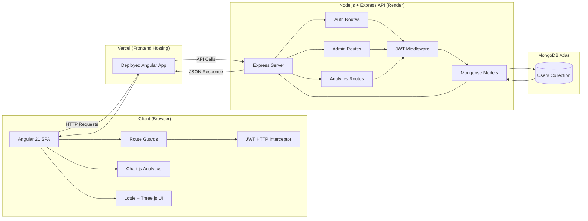

# SmartWinnr Admin Dashboard

A full-stack admin dashboard built with the **MEAN stack** (MongoDB, Express, Angular, Node.js) featuring role-based access control, real-time analytics, interactive quizzes, and rich animations.

## Live Demo

- **Frontend:** [https://smart-winnr-assignment.vercel.app](https://smart-winnr-assignment.vercel.app)
- **Backend:** [https://smartwinnr-assignment.onrender.com](https://smartwinnr-assignment.onrender.com)

**Demo Credentials:**
- **Admin:** `admin@smartwinnr.com` / `admin123`
- **User:** `user@smartwinnr.com` / `user123`

## Tech Stack

### Frontend

| Technology | Version | Purpose |
|---|---|---|
| Angular | 21.1.0 | SPA framework (standalone components, signals) |
| TypeScript | 5.9 | Type-safe JavaScript |
| Chart.js | 4.5 | Interactive analytics charts (line, bar, doughnut) |
| Lottie Web | 5.13 | JSON-based animations |
| Three.js | 0.182 | WebGL floating lines background |

### Backend

| Technology | Version | Purpose |
|---|---|---|
| Node.js | 22.x | JavaScript runtime |
| Express | 4.21 | REST API framework |
| MongoDB | — | NoSQL database |
| Mongoose | 8.9 | MongoDB ODM |
| JSON Web Token | 9.0 | Authentication tokens |
| bcryptjs | 2.4 | Password hashing (12 salt rounds) |

### Deployment

| Service | Purpose |
|---|---|
| Vercel | Frontend hosting |
| Render | Backend hosting |
| MongoDB Atlas | Cloud database |

## Features

### Authentication & Authorization
- JWT token-based authentication
- Role-based access control (Admin / User)
- Protected routes with Angular guards
- Password hashing with bcrypt

### Admin Dashboard
- User management — create, delete, promote/demote users
- Statistics cards with animated Lottie icons (total users, admins, new this week/month)
- Full user table with role chips and action buttons

### Analytics (Admin Only)
- **Line chart** — cumulative user growth over 12 months
- **Bar chart** — monthly new signups
- **Doughnut chart** — admin vs user role distribution
- Auto-refresh every 30 seconds with manual refresh option

## System Architecture



## Project Structure

```
SmartWinnr_Assignment/
├── admin-dashboard/             # Angular 21 frontend
│   ├── public/assets/           # Lottie JSONs, images, logo
│   ├── src/
│   │   ├── app/
│   │   │   ├── pages/
│   │   │   │   ├── landing/     # WebGL landing page
│   │   │   │   ├── login/       # Sign in with Lottie icon
│   │   │   │   ├── register/    # Sign up with Lottie icon
│   │   │   │   ├── dashboard/   # Admin user mgmt
│   │   │   │   └── analytics/   # Charts & stats (admin only)
│   │   │   ├── components/
│   │   │   │   ├── floating-lines/  # Three.js WebGL component
│   │   │   │   └── toast/           # Toast notifications
│   │   │   ├── services/        # AuthService, ToastService
│   │   │   ├── guards/          # Auth & role route guards
│   │   │   ├── interceptors/    # JWT auth header
│   │   │   └── app.routes.ts 
│   │   └── styles/        # Global styles 
│   ├── package.json
│   └── vercel.json
├── backend/                     # Express backend
│   ├── src/
│   │   ├── models/              # Mongoose User schema
│   │   ├── routes/
│   │   │   ├── auth.ts          # Login, register
│   │   │   ├── admin.ts         # CRUD operations, role toggle
│   │   │   └── analytics.ts     # Overview, signups, distribution
│   │   ├── middleware/auth.ts   # JWT verify & admin check
│   │   └── server.ts            # Express app entry point
│   ├── tsconfig.json
│   └── package.json
└── README.md
```

## Getting Started

### Prerequisites

- Node.js 18+
- MongoDB (local or Atlas connection string)

### Backend Setup

```bash
cd backend
npm install
```

Create a `.env` file:

```env

MONGODB_URI=mongodb+srv://<username>:<password>@cluster0.l3vntdx.mongodb.net/admin_dashboard?appName=Cluster0
JWT_SECRET=your_jwt_secret_here

```

### Frontend Setup

```bash
cd admin-dashboard
npm install

# Development server (http://localhost:4200)
ng serve

```

## API Endpoints

| Method | Endpoint | Auth | Description |
|---|---|---|---|
| POST | `/api/auth/register` | — | Create new account |
| POST | `/api/auth/login` | — | Sign in, get JWT |
| GET | `/api/auth/me` | JWT | Get current user |
| GET | `/api/admin/users` | Admin | List all users |
| POST | `/api/admin/users` | Admin | Create a user |
| DELETE | `/api/admin/users/:id` | Admin | Delete a user |
| PATCH | `/api/admin/users/:id/role` | Admin | Toggle admin/user role |
| GET | `/api/analytics` | Admin | Overview, signups, roles |

## Libraries Used

| Library | Usage |
|---|---|
| `chart.js` | Line, bar, and doughnut charts on the analytics page |
| `lottie-web` | Animated icons on stat cards, buttons, login/register pages, and quiz completion |
| `three` | WebGL floating lines background with custom GLSL shaders on landing, login, and register pages |
| `bcryptjs` | Secure password hashing with 12 salt rounds |
| `jsonwebtoken` | JWT generation and verification for stateless auth |
| `mongoose` | MongoDB schema definitions, validation, and queries |
| `dotenv` | Environment variable management for secrets |
| `cors` | Cross-origin request handling between frontend and backend |
